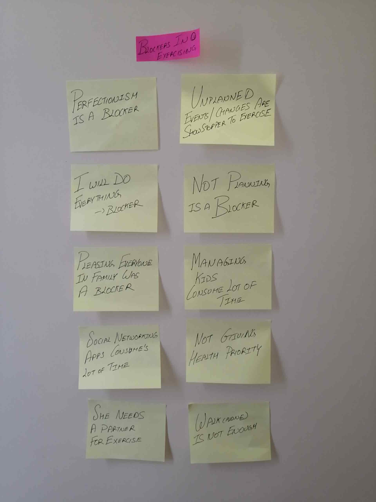
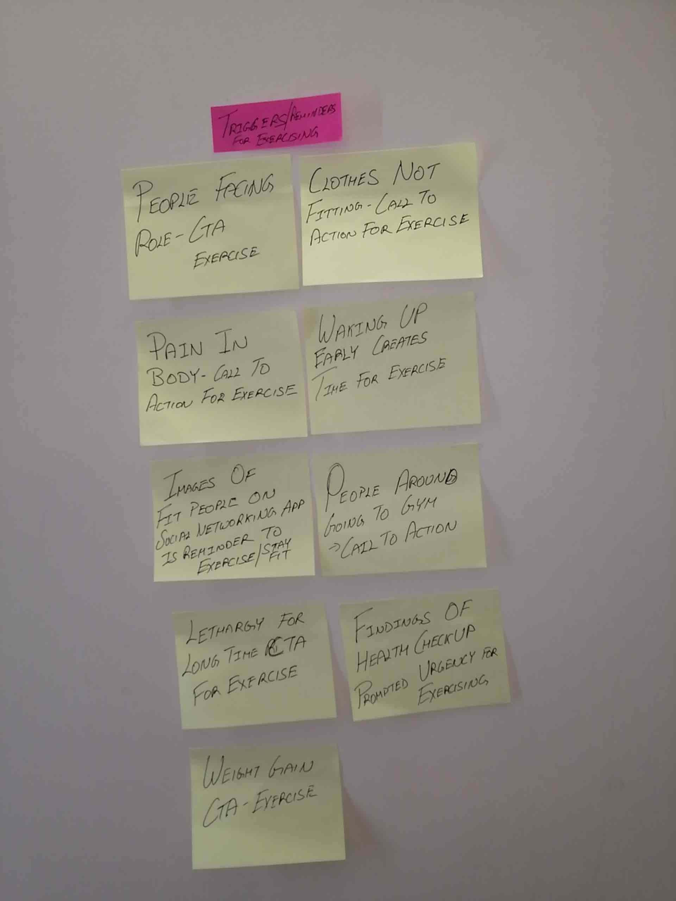
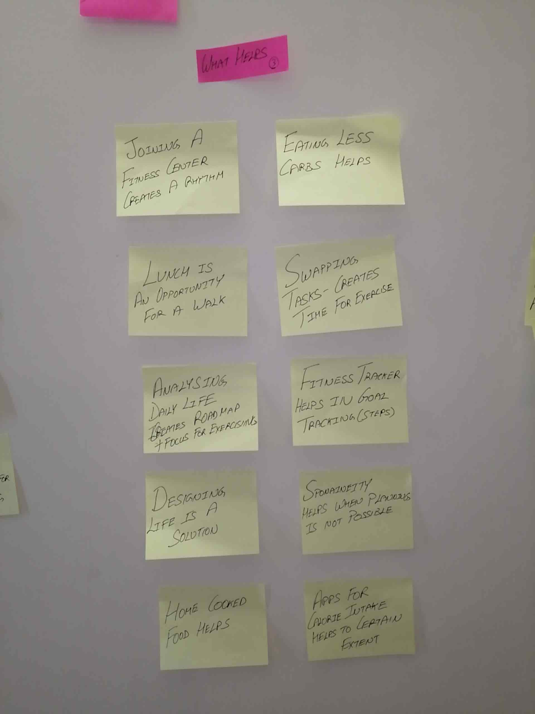
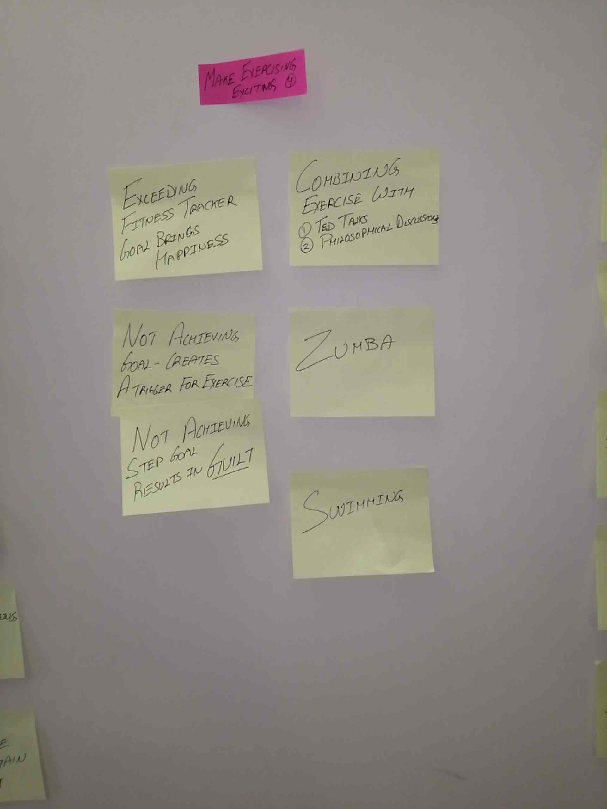
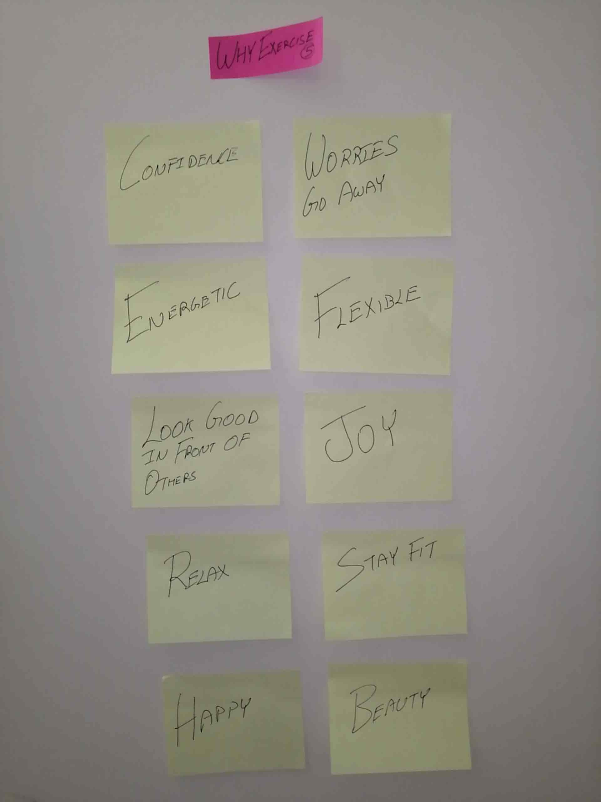
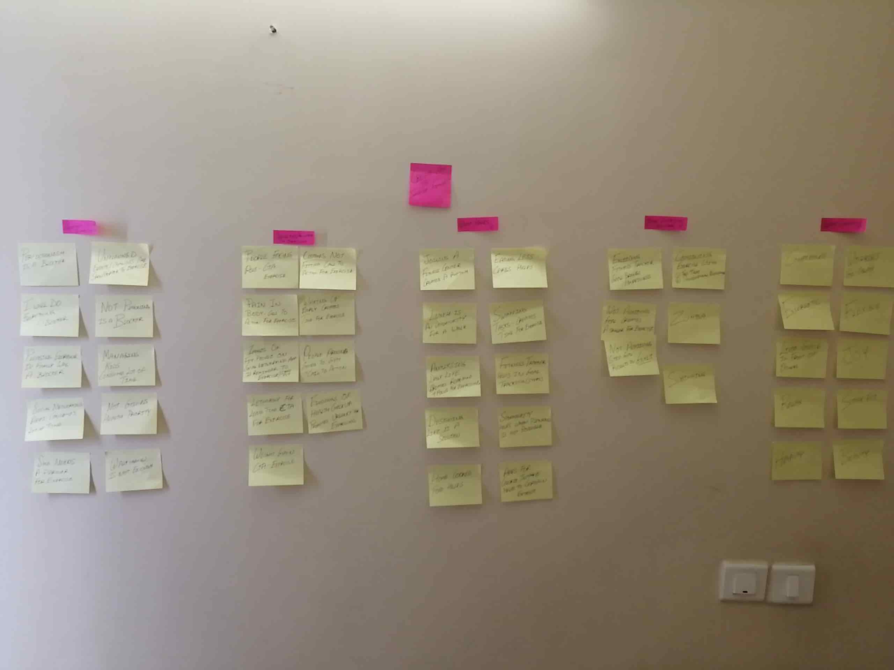
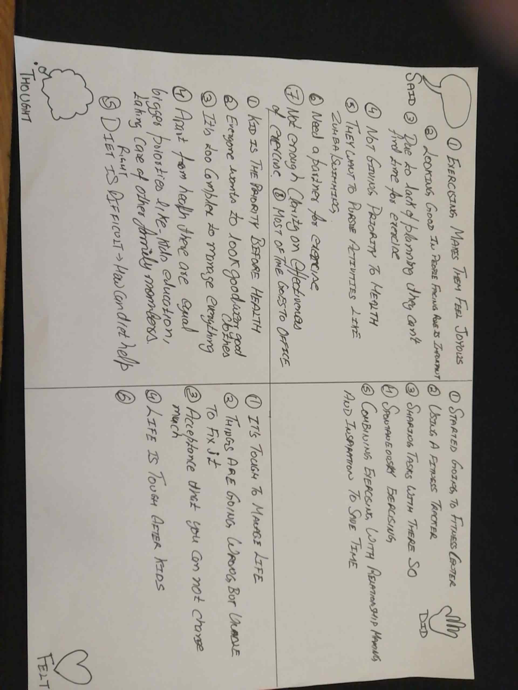
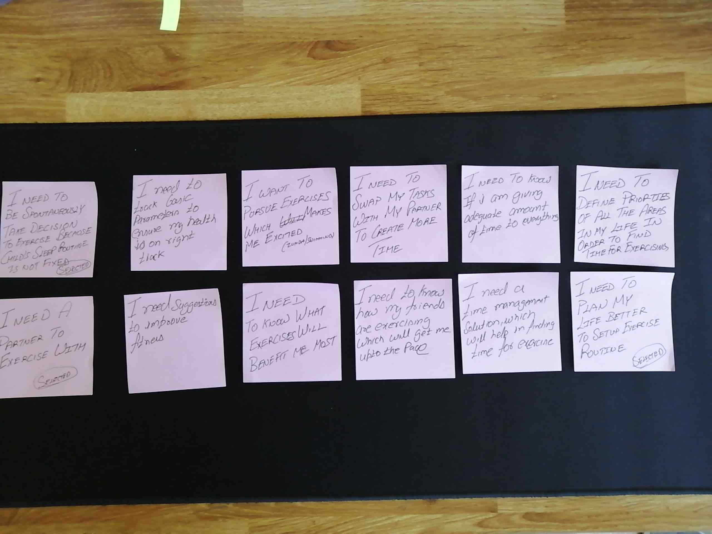
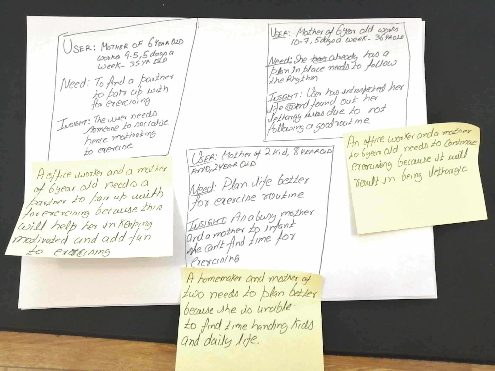

In my last post, I documented interviews. Apart from interviews, I gave probes to users and two out of four replied with probes. Tried chasing people but it didn't help.

Continuing with Design thinking this week I learnt about Define phase.  In a nutshell outcome of this phase is the human-centred definition of a problem. 

The case study I am pursuing is: **Creating a fitness app for people who are not able to find enough time exercising.** 

Here is the step by step approach I took for define phase.  

1. I noted down all the ideas and grouped them and ordered them in priority that's called as Affinity Map.   I chose the priority order which I felt was right, for me the blockers a user phase is of the highest priority. 

2. After grouping ideas into themes, on these themes I created an empathy map i.e. how a user thought and felt. Followed by filling up Said and Did. 

3. Looking at all the quadrant wrote down the user needs, this will become the basis of what problem you want to solve for them.

4. As per the instructions of Design Thinking course from IDF I need to select 1-3 needs which are most important for user and create a point of view. 

I have a question on this approach, dont see a strong criteria in selecting the need. To me its like introducing a personal bias.  To clear my doubt I ended up posting this question on reddit and intereaction-design.org

https://www.reddit.com/r/UXDesign/comments/e29xc3/question_empathy_map_to_point_of_view/

5. Based on this I created a Point of View Madlibs and lastly I wrote down "How might we" questions. 

How might we questions will become basis of Ideation phase.

Here are the screenshots of process I followed.  Starting with groups in **Affinity Diagram:**

1. **Blockers in Exercising**

   

2. **Triggers for Exercising**

   

3. **What Helps**

   

4. **Making Exercising Exciting**

   

5. **Why Exercise**

   

The reason why I chose this priority order is that blockers are obstructions to users and if we understand them well we can come up with a solution. 

Overall my affinity diagram looks like this:

After completing affinity diagram next task is to develop an empathy map.  The map is divided into four quadrants and captures following.  What user :

1. Said
2. Thought
3. Did
4. Felt

Using the empathy Map I identified needs for the users

I selected most important needs for a user and developed point of view.

Using the Point of View I came up with How Might We questions

This is turning out to be interesting because now I can see lot of information crystallised into specific how might we questions.  Now its time to focus on Ideate phase of Design thinking