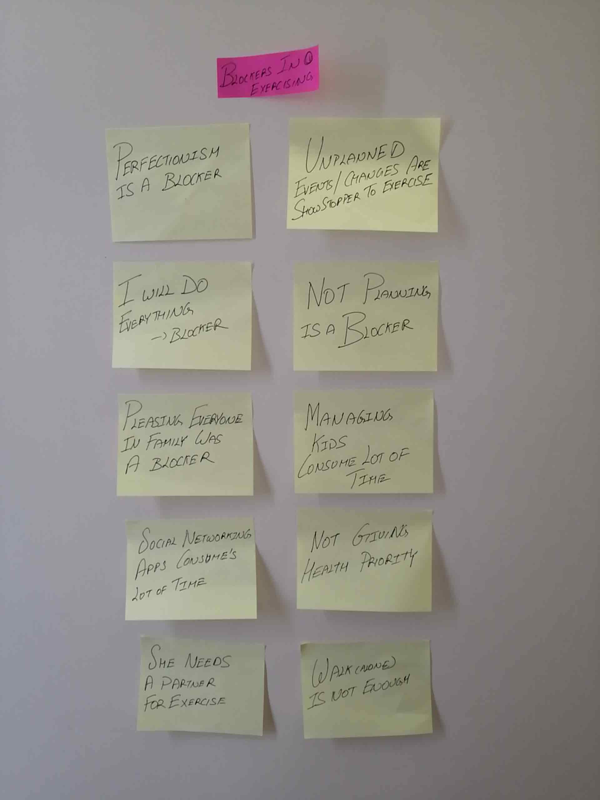
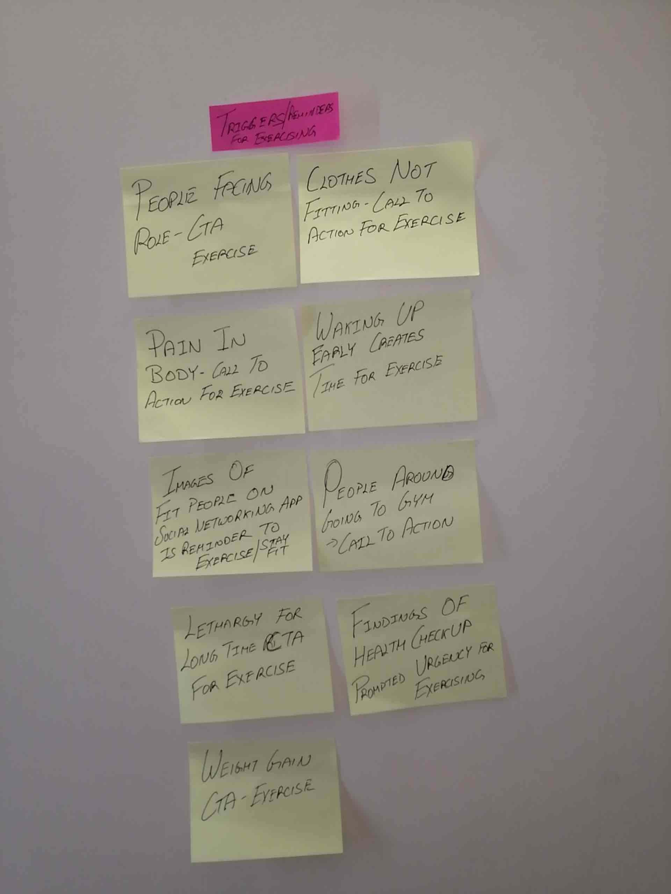
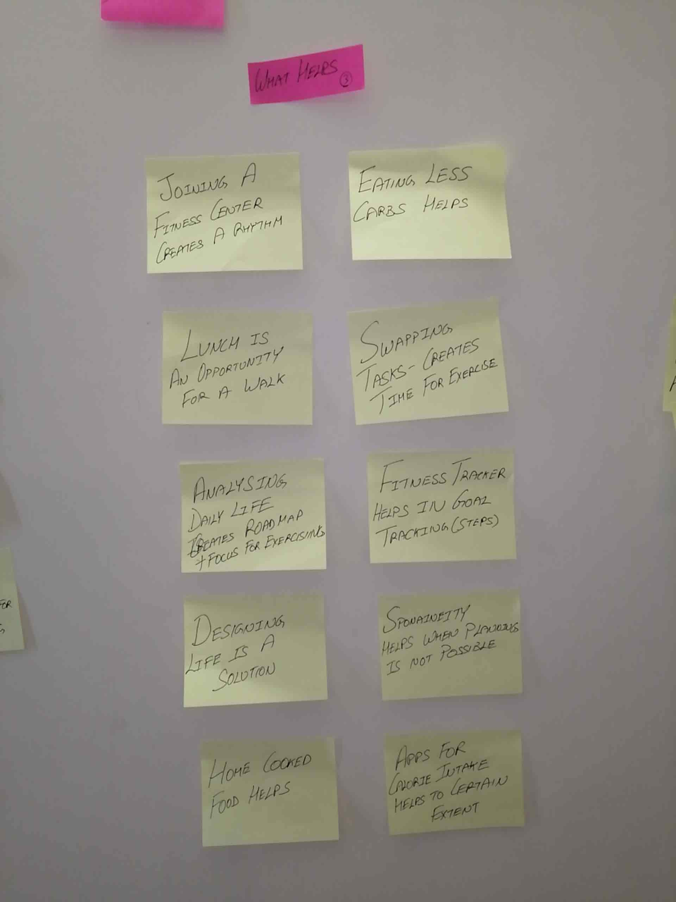
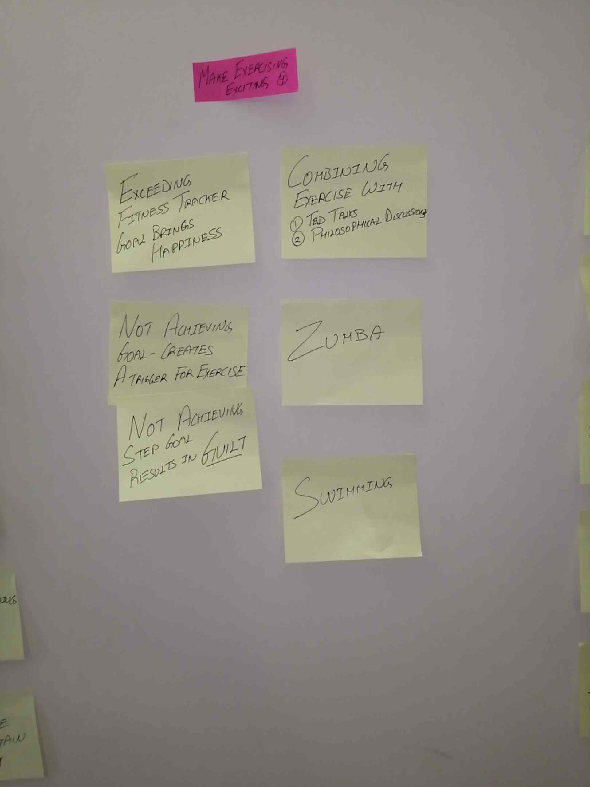
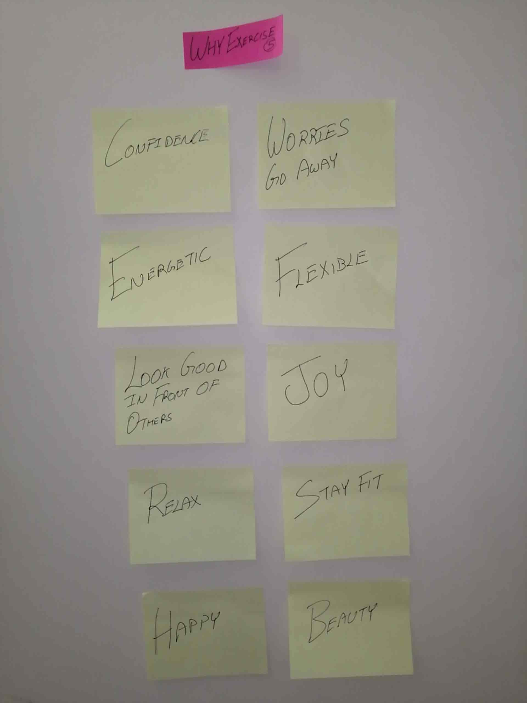
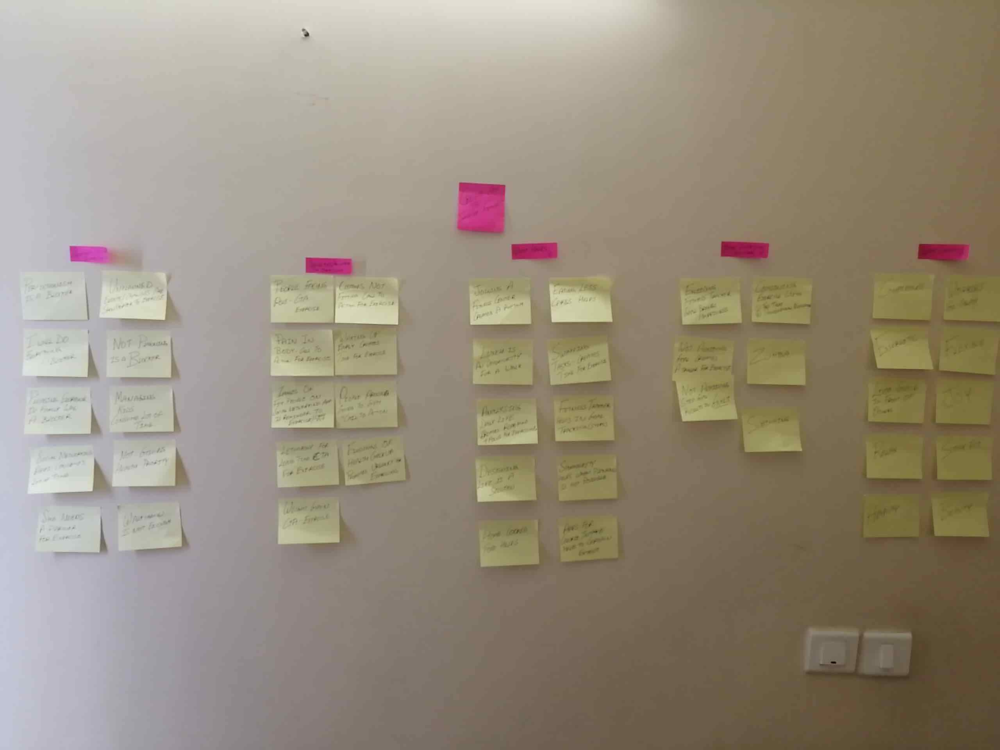
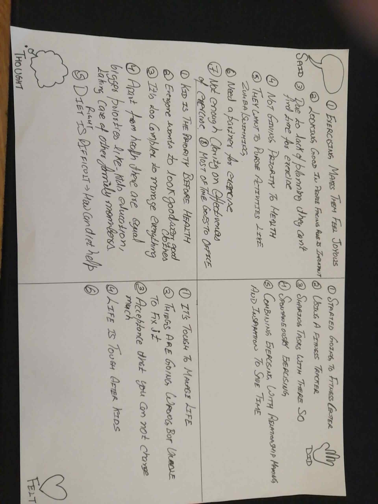
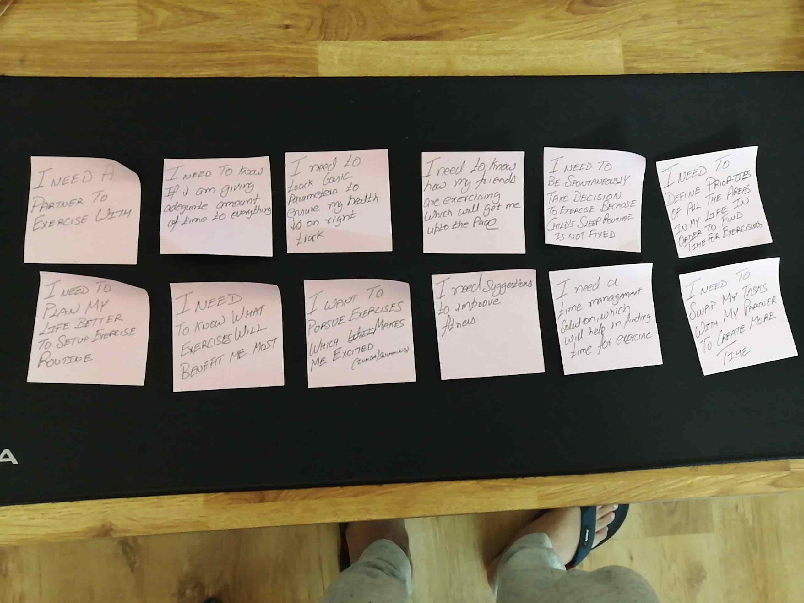
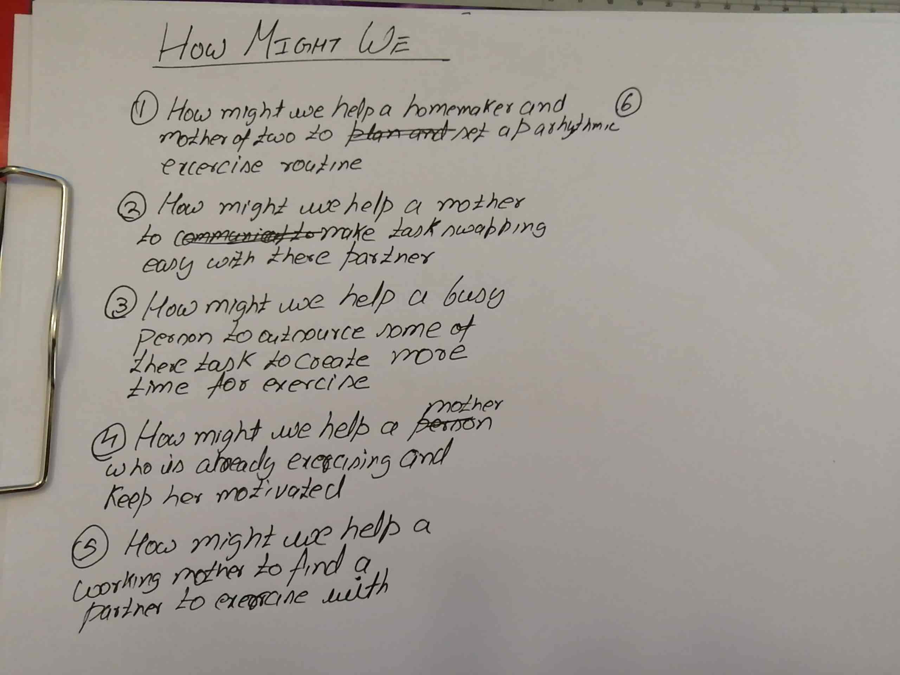

In my last post, I documented interviews. Apart from interviews, I gave probes to users and two out of four replied with probes. Tried chasing people but it didn't help.

Continuing with Design thinking this week I learnt about Define phase.  In a nutshell outcome of this phase is the human-centred definition of a problem. 

The case study I am pursuing is: **Creating a fitness app for people who are not able to find enough time exercising.** 

The first task of the Define phase is to create an affinity diagram. To start with this activity I wrote down all my findings of empathy phase in sticky notes and stuck them into a wall. 

 Later I reorganised all the sticky notes into groups/clusters.  This is how my groups look like in priority order:

1. **Blockers in Exercising**

   

2. **Triggers for Exercising**

   

3. **What Helps**

   

4. **Making Exercising Exciting**

   

5. **Why Exercise**

   

The reason why I chose this priority order is that blockers are obstructions to users and if we understand them well we can come up with a solution. 

Overall my affinity diagram looks like this:

After completing affinity diagram next task is to develop an empathy map.  The map is divided into four quadrants and captures following.  What user :

1. Said
2. Thought
3. Did
4. Felt

Using the empathy Map I identified needs for the users

I selected most important needs for a user and developed point of view.

Using the Point of View I came up with How Might We questions

This is turning out to be interesting because now I can see lot of information crystallised into specific how might we questions.  Now its time to focus on Ideate phase of Design thinking