I had a great time Ideating last week. The reason why it was most interesting experience of my life is because : my mind was clouded with problems, doubts about Case Study.  When I went through Ideation I could see the possibility of addressing the problems. This is my first experience doing a case study and I realised how important to be inside the problem space for a long time.

When I started the Ideation phase I learned about a lot of approaches and pros and cons of each. The case study is about creating a mobile app to improve fitness.

In my last post I generated How might we questions and Empathy Map. Here is the summary of the approach I took for the Ideation phase.

1. Generating Worst Possible Ideas - Looking at Point of View , How Might We Questions and Empathy Map I listed down worst possible ideas
2. Converted Bad ideas to Good one.
3. Listed down all the assumptions.
4. Challenge Your Assumptions.
5. Turn your Challenge into Ideas.
6. Evaluate Ideas using Six thinking hats.
7. Select an Idea to help you address your user needs. 

## Details

------

I started Ideation with worst possible ideas. This is the most fun activity and I feel when done in a group it will be a great icebreaker. 

The ideas I listed were untehical, disntegrated, deceptive, cunning and devious.  WOW!

Can any one be more negative then me?

   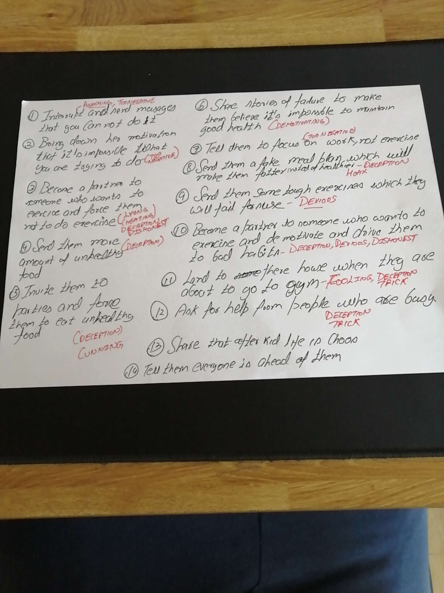

The reason why this exercise works so well is because our minds can do reverse perspective very easily. For e.g. One of my cunning ideas was to : "Invite them to parties and serve unhealthy food" the opposite of that would be simple to construct.  Offer them healthy food.

Here is my list of turning bad ideas to good one:

   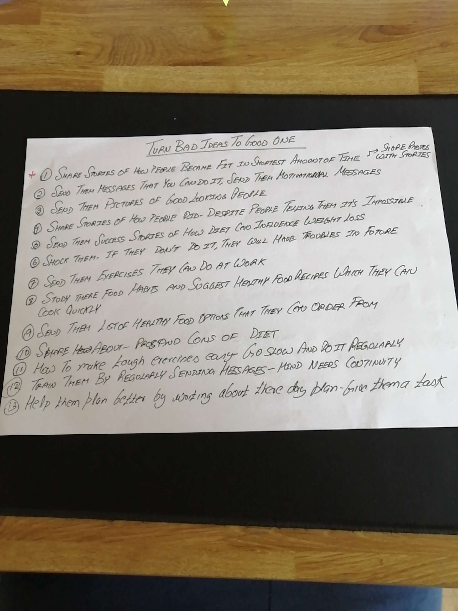

   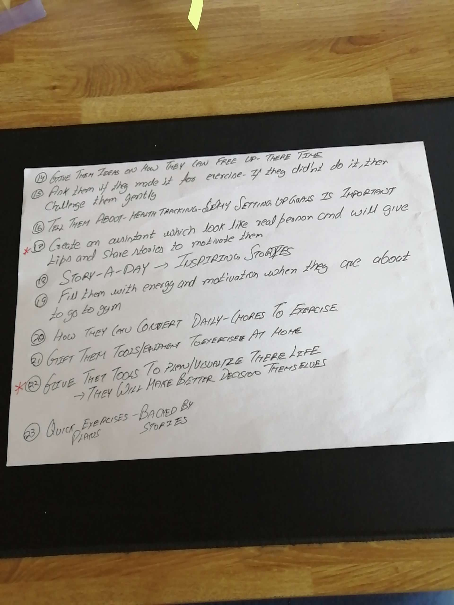

While this exercise was easy to do and I was able to generate lot of ideas in shortest span of time. 

The second method I took to generate Ideas was "Challenge your Assumption".  This exercise was all about creating list of assumptions that use has . For .e.g One of my assumption is "People thing they are doing there best" this thinking prevents them for doing something different.

   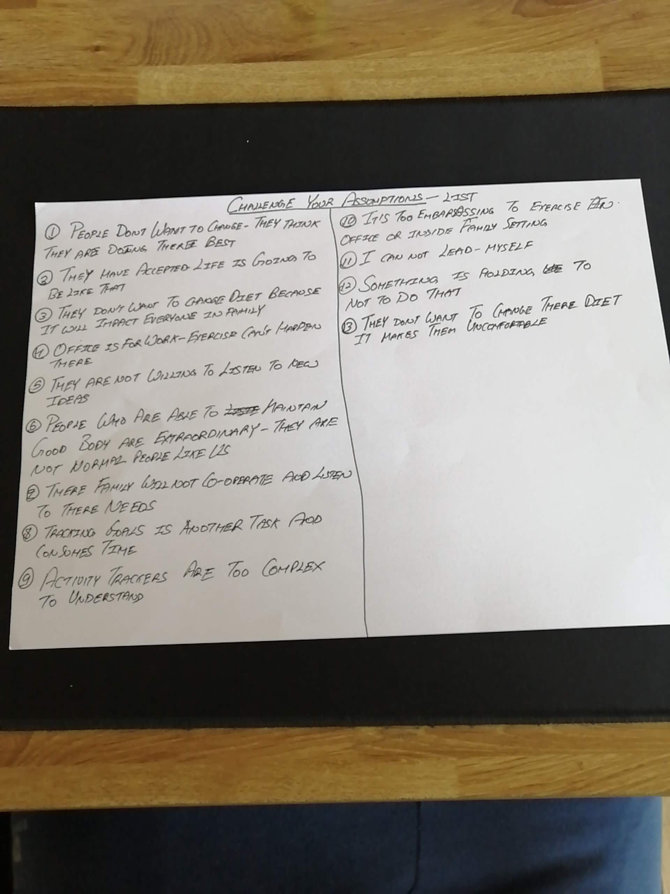

Step 2 of this method is listing down the challenges to assumptions. For e.g. One of my assumption was : "People have lost there interest and they dont want to change."  One of the challenges to my assumption could be : "What if people are interested but no one has genuinely showed them the way"

   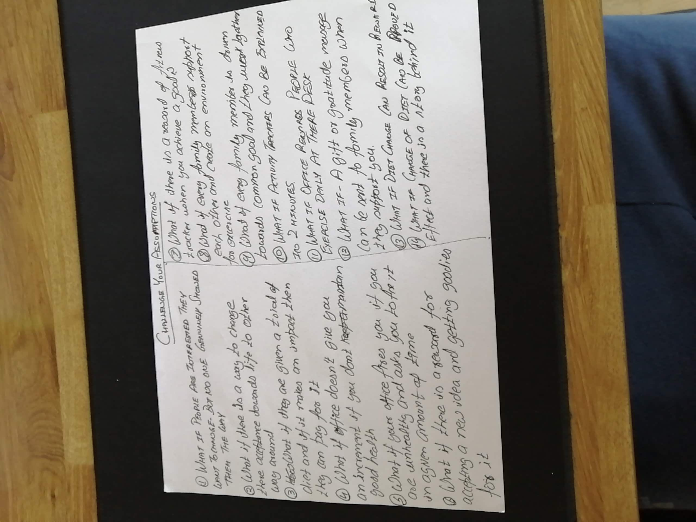

The last step of this method is listing down ideas for challenges.  For e.g. One of my ideas is that people can change if we tell them a real life story.  If that story meets there situation they are facing it can be very effective.  Here is the list of Ideas I came up with

   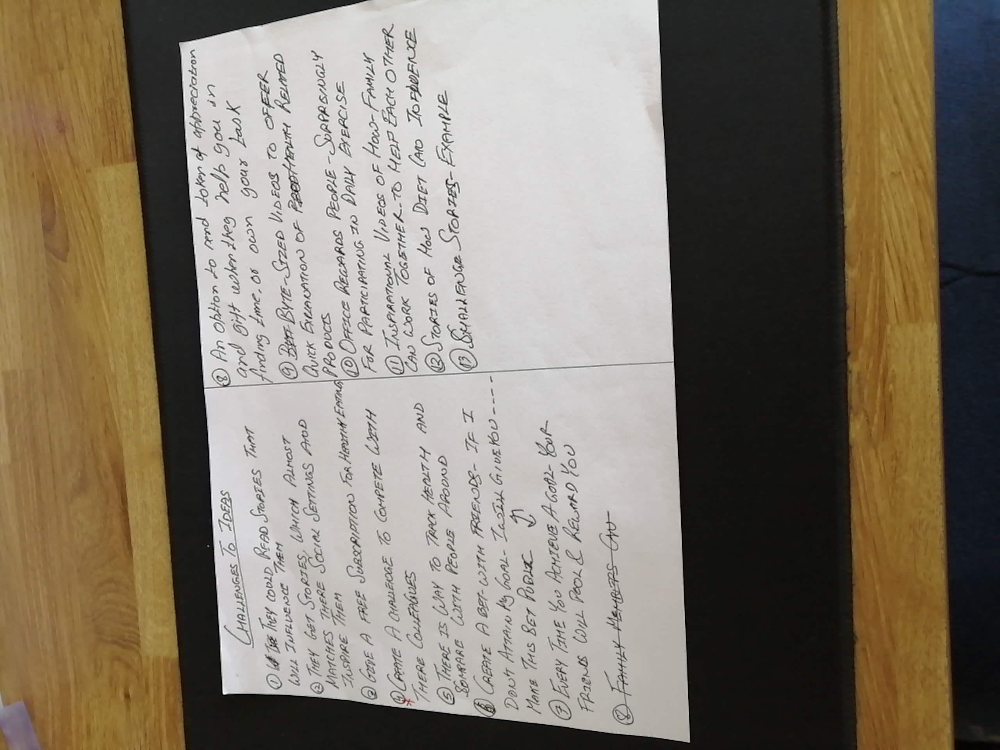

By the end of these two methods I was able to come up with lot of ideas.   How would you choose the idea that you want to pursue?  

I evaluated my ideas with Six Thinking Hats method.  I also spent some time reading the book, which I think is a must read.

   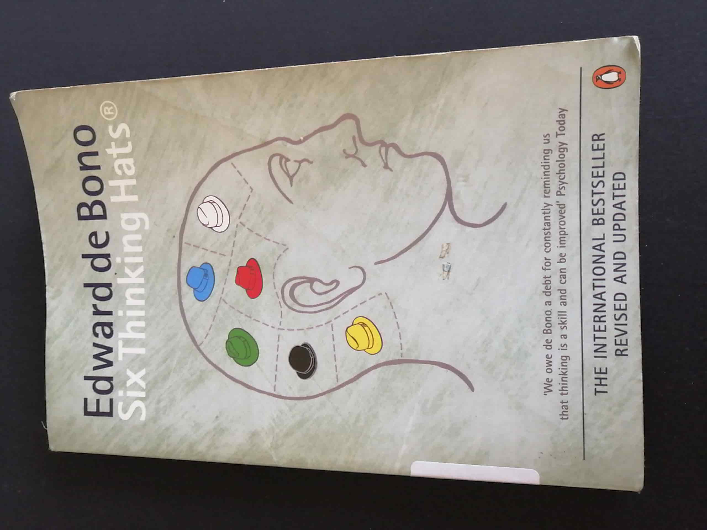

Here is the first idea and how I applied Six thinking hats method to it:

Idea 1 : Share stories of how people became fit in shortest amount of effort.

   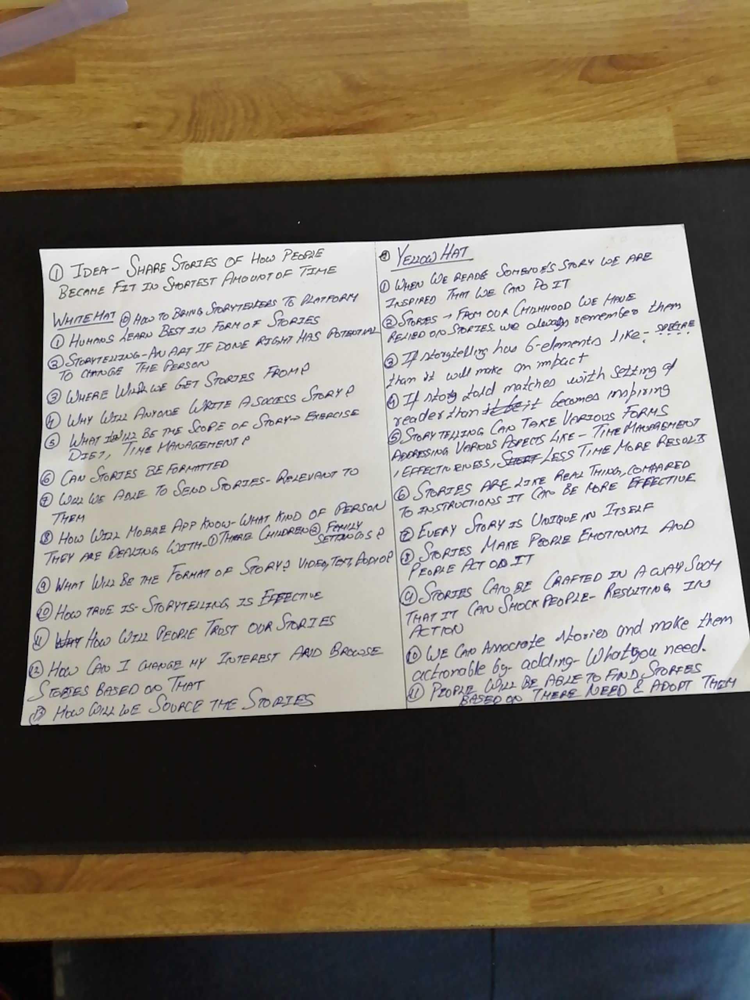

   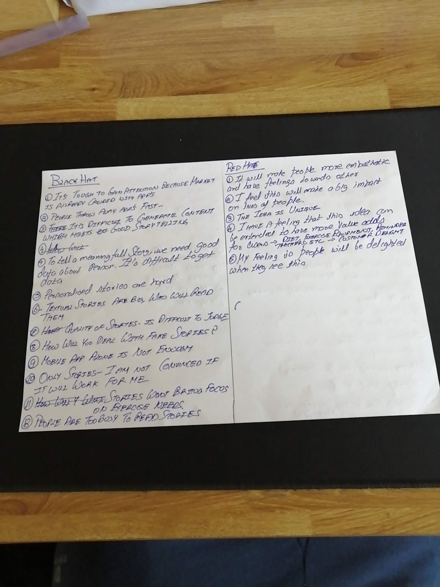

   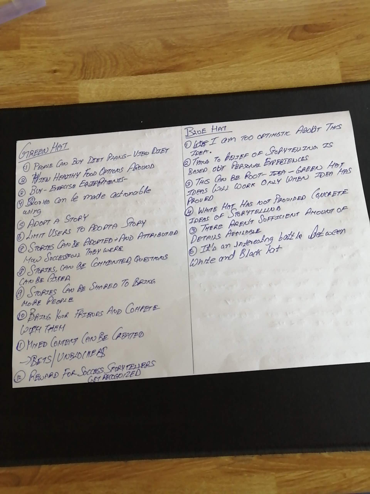

   My Idea  number 2 is about providing a virtual assistant to help them in following aspect of lives:

   1. Unblocking there mind
   2. Personalised Diet
   3. Tracking Health Goals

Here is how I applied Six thinking Hats to it:

   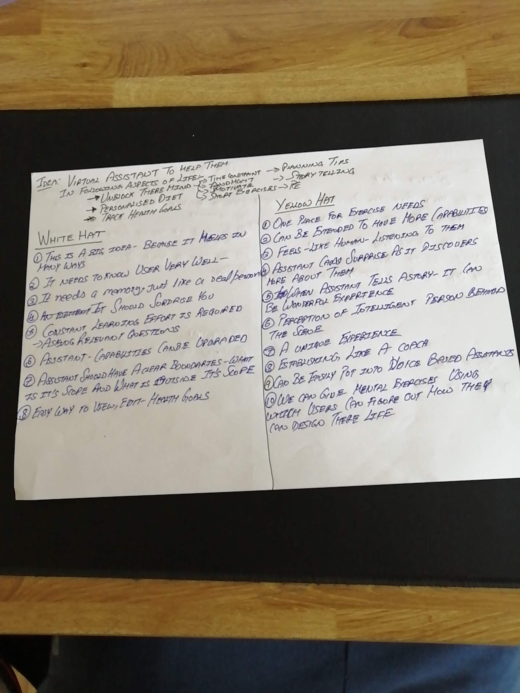

   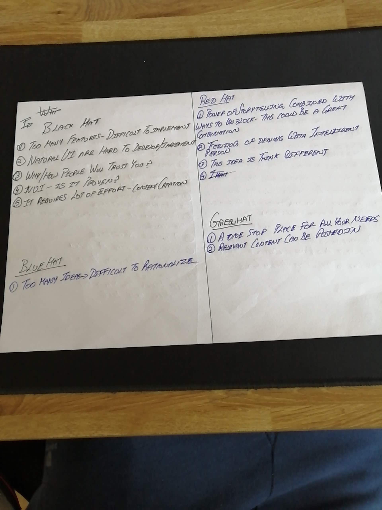

I have had many ideas to solve this problem and I its unpractical to apply six thinking hats to each and every problem.  I choose to go with Idea # 1 i.e. **Sharing real life stories to influence people.**  

The reason why I chose this idea is because of its simplicity to implement as compared with Idea #2.  Idea #2 is pretty big.  If I start with Idea #1 and if it succeeds than I can transform that to assistant in future.   Considering I have two promising ideas and limited time in hand I will choose to go with simplest of idea and test it.  If it doesn't work than tweak it.  

By means of story telling I can ensure I can meet all the user needs. All this will make more sense when this idea takes form.  Which will happen in : Prototype Week.

Stay tuned.