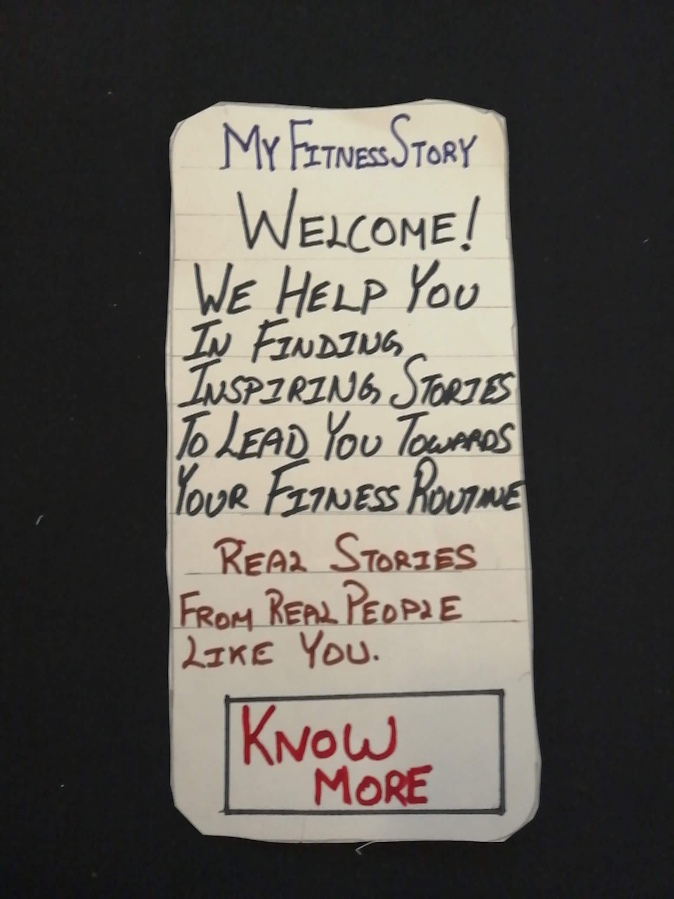
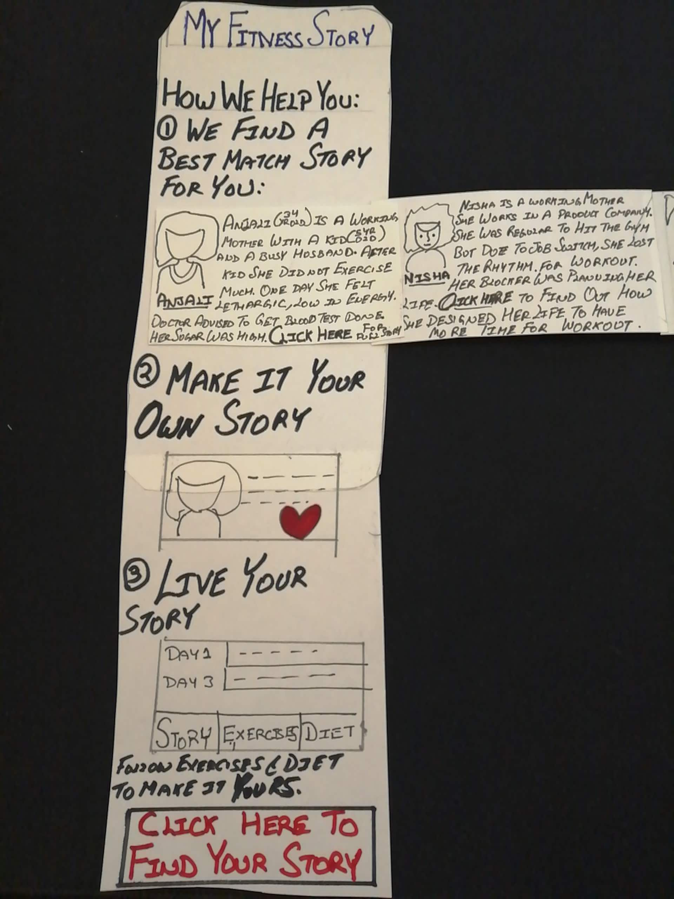
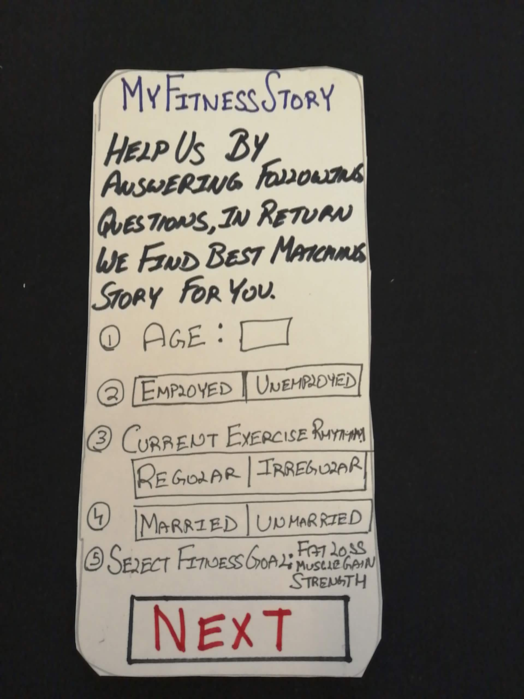
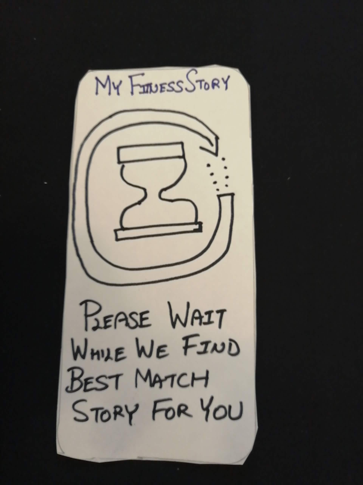
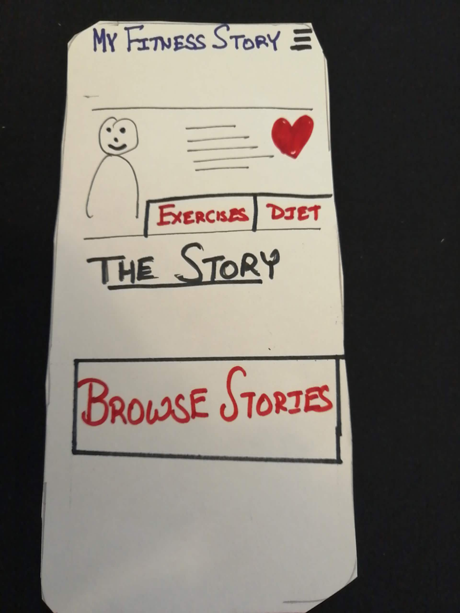
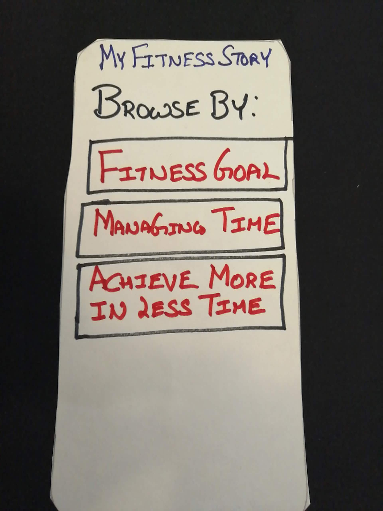
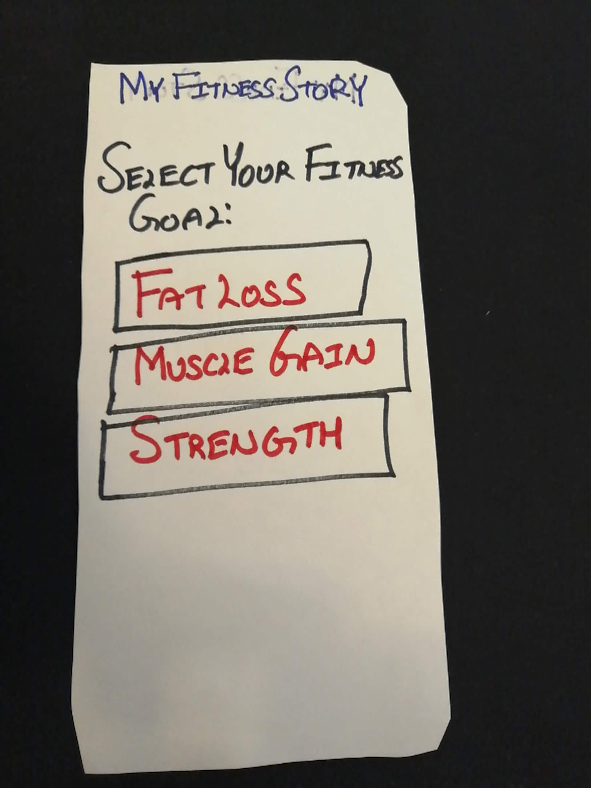
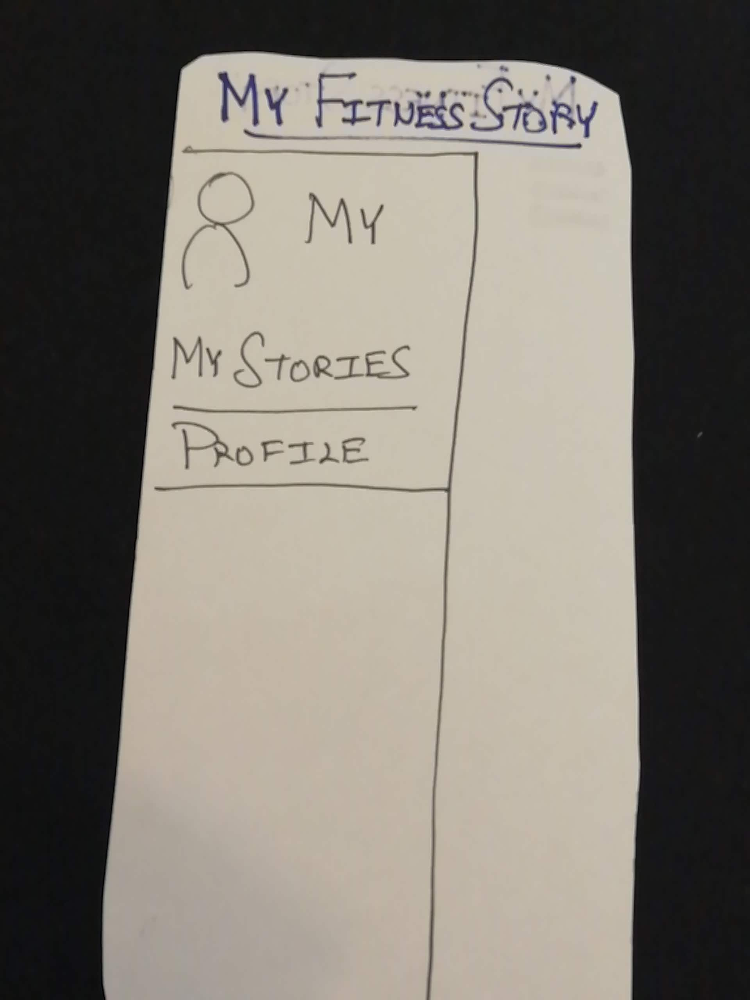

I am having an amazing time prototyping. Had an amazing time in Empathize stage, Define and Ideate.  Comparing joy of both is like comparing Apple and Oranges.  I don't mind sharing my experience so far here it is:

Empathise was about listening to people and understand them.  It certainly made me a better person. When I listened to recordings in the interview I realized about myself.  It's like seeing yourself through the eye of another person.  There were things which I didn't even know about myself.

Define phase is where I broke down the information into pieces and synthesised it to create something meaningful.  When I look back all I can say is Journey was the reward.  

Ideate, I loved it.  I wished these techniques especially "Worst Possible Idea" was so much fun and sparked my mind of new possibilities.  Six thinking hats were fun too but I guess it will be more fun in the group. 

Now coming back to Prototype.  I started with Storyboards. Here is the video of the storyboard.

Once I created the Storyboard I started getting a sense of how the user interface should look like. 

Here are the pictures for paper based prototype.

   
   
   
   
   
   
   
   

## Next Steps

Now I need to test Storyboard and Prototype on my users with whom I did Empathy exercise and record feedback for it. 