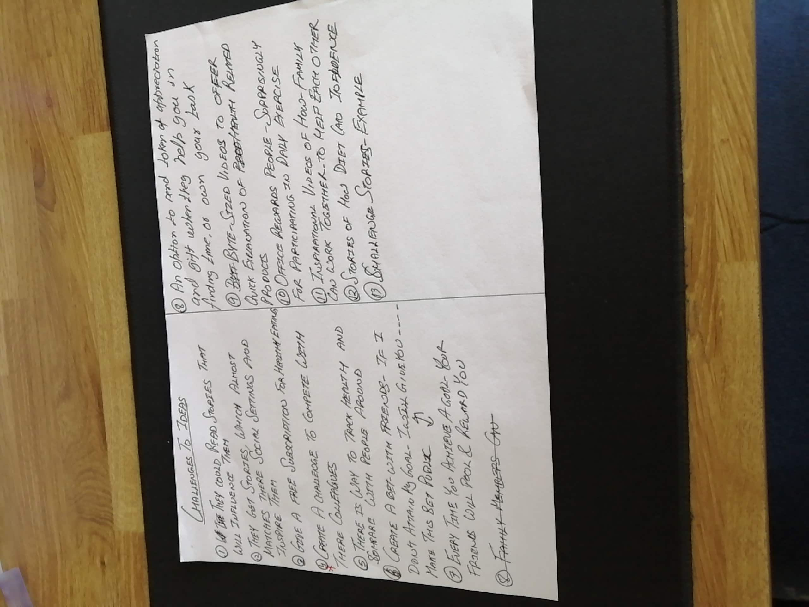

# Sections Inside Portfolio:

Whole portfolio can be divided into three parts:

1. Beginning - Problem Statement
2. Middle or Process (UX Deliverables)
3. Reflection on the process

## Documenting Beginning of Case Study

------

Guidelines:  UX Case Study tells a story, a story based on an Idea.   Start with a question

Divide the beginning into three parts:

1. About Project - Problem Statement
2. Goal
3. My role until the end - Max 4 -5 Sentences

Here is my attempt to document the beginning section of the portfolio:

> ### Problem
> Why are people not giving time to there fitness despite knowing it could be damaging to there health? Is there a truth in the reasons given by a busy person who chose not to exercise? MyFitnessStory is a journey to find out what is stopping us from not paying attention to our health. 
>
> ### Solution
> Took a human centred design approach i.e. Design Thinking navigating stages by stages to create a solution. 
>
>
> ### Goal
>
> Drove the whole case study by recruiting participants, scheduling interviews, defining problem statement, ideating, selecting ideas, testing them with a Prototype.  It's a self-driven learning project. 

### Overall

Here I have documented the beginning section of the case study.   It comes to 6 sentences which is one sentence extra than what is suggested.  At this point, I am not sure what can be taken out so leaving this as is. 

## Documenting UX Deliverables

------

This is the section where I will be judged on the process I have undertaken and why I made decision in certain way. How did I decide between two different choices.  How did I involve Users and how did I carry out my tests.

As I understand Text plays a bigger role than Visuals. Its like Visuals will support the text.  Use core elements of design thinking as steps to outline the case study.   I used Canva.com to create persona below, in case you know a better tool please comment.

> UX Projects do not follow a linear methodology, but for the purpose of this case I am describing the work done during different phases in a linear structure below:
>
> ### Empathy
>
> I recruited four users for my case study.   Before conducting interviews I developed an Interview guide.  Apart from relying on my Interview guide, I asked questions spontaneously as well to understand the reasons behind what a participant is saying. 
>
>  
>
> Here is a persona I developed as part of the Empathy phase:
>
>  
>
> After every Interview, I handed over probes to users.  These are the probes I developed:
>
> \#1. Create a daily Timeline.
>
> \#2. Click pictures of what motivates you to do exercise.
>
> \#3.  Create a Stop Doing List.
>
> 2 out of four participants replied to probing kit and mentioned that they can figure out where their time is getting wasted.  Here are the two culprits identified :
>
> \#1. Morning time - It's not efficiently utilized.
>
> \#2. Time spent on mobile - This was revealed when one of the participants was asked to create a stop doing list. 
>
> Another outcome from probes was that people get motivated to exercise when they see photos of fit people on there Instagram feed.
>
>  
>
>  
>
> With this much data I got out from my participants it almost felt like this case study is going no where because every one has different reasons.  At the end of Define phase I felt magnified and zoomed into the problems of my users.
>
> ### Define
>
> I took all the data collected from the Empathy phase and create an affinity diagram. 
>
> 
>
> TODO : Picture of Affinity diagram
>
> Major themes of Affinity Diagram in priority order:
>
> 1. Blockers for Exercising
> 2. Triggers/Reminders for Exercising
> 3. What helps for fitness
> 4. Make exercise Interesting
> 5. Why Exercise
>
> I created an Empathy Map by capturing data from major themes collected in Affinity diagram.
>
> 

> I translated Empathy Map to "User Needs"
>
> 
>
> 
>
> Selected most important needs and developing a point of view:
>
> 
>
> 
>
> I converted POV to how might we questions:
>
> 
>
> ### Ideate
>
> Started off this phase by "Generating Worst Possible Idea" . 
>
> 
>
>  Turning Bad Ideas to Good One

> 
>
> The second Ideation technique I used is "Challenge You Assumptions"

​			

> Converting Challenges to Ideas
>
> 
>
> 
>
> Selected two Ideas and applied SixThinkingHats to select one of them

​			Winner Idea:   Sharing Stories of how people became fit despite being busy. 

**WAIT!  WAIT! WAIT!**

After writing all this I have a realisation that writing will not help here. Instead a paper prototype will be a better choice.  

I went ahead and converted all this text written into a paper prototype and sticked it together.  This is how it looks like:

Creating a paper prototype turned out to be a better decision because now I can visualize what kind of experience I can give to users.

Now my brain is sparked with ideas, I am thinking of how cool I can make it.  These arrows can come together to create a story.  

**NEXT STEPS**

I have an image in my mind how it should look like in the sense of interaction.  But I need to find ways to make it real. So next week i.e. 52 which is the last week of the year I will try to implement this.