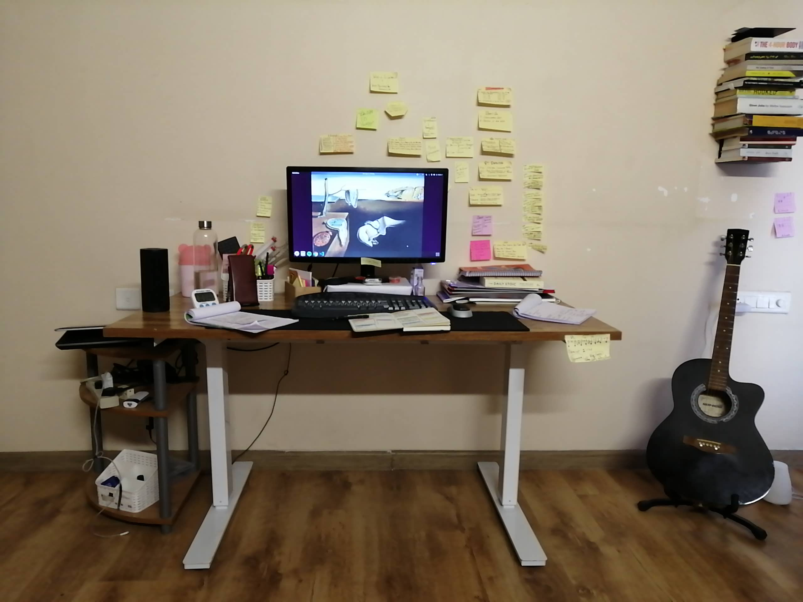

Last day of the year and If I look back what a rollercoaster ride it was. Coming out of a full-time job and doing something that I wanted to do was not that straightforward. I mean the path was not straightforward. I guess it will be always like that, even the future to come by who knows.

There were some great learnings this year since it will be difficult to put in a sentence I would share it in points.

1. **Creating a home office** 

Having a personalised space where you can work alone can do wonders. When I started my journey I had a choice to either go to a coworking space or work from home. Considering this is the investment I made on myself I decided not to spend too much and save money.   Space could be anywhere but It has a lot to do with psychology.  A personalised space means you can decorate it in your way. 

Your office space means you can create rituals.  When I start my day I start with a ritual like: Is My day planned, What changes I will make my day to make it better.  It is inspired by stoicism.  When I end my day I ask did I complete what I planned. 

It might sound very disciplinary but it is giving me results.  The best part of the home office is sticky notes.  Sticky notes are my source to build new habits. When a note is hanging in front of you it reminds you to act.  Having an office space has a psychological impact. 

 

2. **Purpose**

Having a sense of purpose is what saves me when I am feeling low or I am distracted.  I sense that I have two purposes, one is by writing all this I can help others to go that path.  Second is that I want to solve great problems via design.  Both of the purposes connects.  I have already started working on a side project which is about habit-building.  Will share more about it as it matures.  There is a prototype in place and design is in use. Having a side project is going to keep me fulfilled until I find out work.  If 2019 was great then the purpose has a lot to contribute towards it.

3. **Cleaning up and Productivity**

I have a lot to say on this when I was in a job I hardly paid attention to finance, house cleaning, development of my child.  Due to which it created blocks in my mind. I was procrastinating a lot of things, coming out of job gave me a bandwidth to clean up a lot of aspects of my life. 

One of the facts that I want to acknowledge is that when I start working again things can become messier.  This is where I have started to build a habit-based system that I regularly do all the things which I never did. 

This is where I have invested in the bullet journal. Everyone gets the same amount of time i.e. 52 weeks.  If you split it can be four quarters.  This is where thinking big can be combined with the road ahead.  I can set goals what I want to achieve in a quarter.  This creates a bandwidth to do a lot more things. Combine bullet journal with Pomodoro technique and you get so much of focus. 

Design of my bullet journal to tackle quarterly goals. 

https://www.instagram.com/p/B6noWpDA8rs/

4. **Education for mind**

I am investing a lot of my time to educate myself, you can say its more like training of the mind.  The inspiration to educate myself came from the fact that we are born as innocent beings but when we grow up we realize that life is not easy.  You will meet cunning people, people who have no morals.  The after-effects of seeing all this is that there are high chances that one can become immoral. The sad part is that you will never know how it happened.  Everyone has there own good reasons why they are cunning, why to act clever.  The reasons are mostly because the outer world is like that.  What we perceive of world outside shapes up our psyche.  This is one area for which our education is completely missing.  Rather than complaining about why the world around didn't educate me properly, I have a choice to re-educate myself. When I started reading Stoicism I realized that I was paying too much attention and spending energy in changing world outside the moment I had self-realization that I don't have control on so many things happening it made an impact on how I think.  I can say it with clarity there are very few things which I can have control over.  The only person I have control over is myself.  This kind of education was missing and I think I have a long way to learn more and more about myself.

This summarizes how 2019 was and let me share what I have for 2020. 

------

Firstly, where do I stand?  I promised to complete my portfolio by the end of this year but it has not happened. Here is what I promised to achieve by the end of this year: https://sumgup.github.io/mysecondlife/PlanOfPlans/

I completed my certification of design thinking which I think went well.  While building my portfolio I realized that learning a prototype tool is a must.  Once I am done building my portfolio I will create a prototype and publish my portfolio again.

Finding work will not happen unless I am done building a portfolio, so I am on the last mile of preparation before I go out and find work.

Here is what I need to do in the next few weeks:

\#1. Build a website with a portfolio.

\#2. Complete training of becoming a UX designer from scratch.

\#3. Keep Blogging.

\#4. Pitch for work.

#5. Free time - Invest on side project.  Github pages for collaboration.

I do have a semi-prepared plan for #4 which I will be sharing once I am ready with my portfolio.  One area I failed to estimate was portfolio designing, it took me longer than what I planned for.  I ended up using bootstrap for design and this is where I slowed down.  Estimates are so hard.

With the new year coming will be back with full spirit and it would be the beginning of another chapter in my life.   Happy new year.