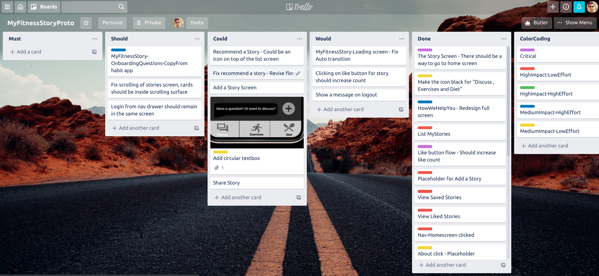
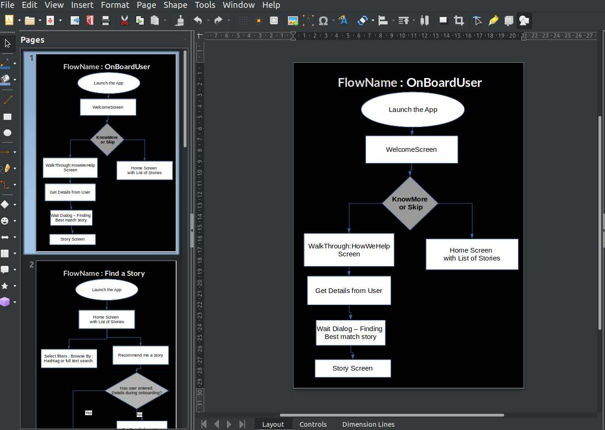
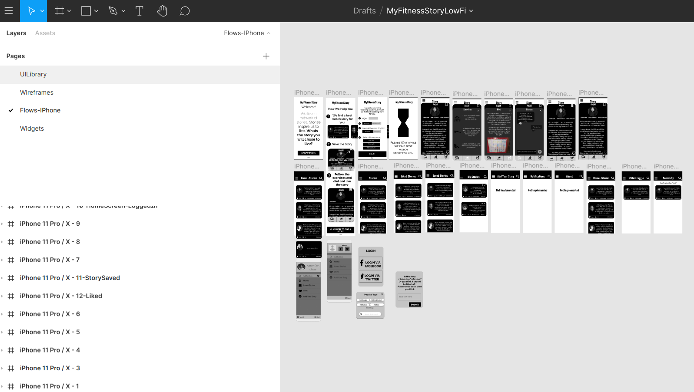

One of the promises I made to myself that before I take up any design assignment I will ensure that I am hands-on in prototyping in one of the tools.  I may be wrong but this skill should be a must have because a prototype is a deliverable.

If you don't want to read my whole journey into prototyping and only interested in knowing what are the outcomes of the journey then here it is:

1. **Design flows not wireframes** - This is a big deal, i remember when I started approaching prototyping I got trapped into thinking of creating screens. It led me to nowhere. The moment I started thinking in terms of user flows it became very obvious. Design most important flows first and later add supporting flows like Onboarding.  Initially, I started designed onboarding and later when I designed core experience I had to make some changes in onboarding. During my next prototype activity, I will do the opposite.

2. **Reuse** - Figma encourages a lot of reuse of design.  I created lot of components are reused them.
   A lot of difference in paper vs real-life prototype - I feel There is a lot of difference between the paper-based approach and designing on a tool. One of the most important difference is you are thinking more from the perspective of interaction. 

3. **Use a priortization technique like MOSCOW** -  Mobile apps looks small when it comes to designing there are too many things to be done. I kept a limited time to develop a prototype.  During the last day, there were too many items to handle.  Our egos get attached to what you are building and we dont want any imperfections to surface.  This is hard.  I wrote down all the pending items in my trello board and priortised them with MOSCOW method. By doing that I found a balance.  None the less on last day it's always a marathon.  That why you will see color coding. 
     		

   

5. **Document inconsistencies** - You can not get everything pixel perfect in the first go.  The awareness of inconsistencies is more important.  
6. **The magic of iterations** -  I liked the way how prototype came up, it's not the best prototype but I remember that when I laid down the foundation it was bare bones.  As I kept on iterating it added flesh to it. This learning is great, as you keep iterating it will become better and better.

Now here is my journey for prototyping. Here is how it all started.

------

I don't want to go too far with prototyping because this area overlaps with  Visual Designer.  To be precise the skill I am targeting to learn is low fidelity prototype.  

Tool choice:  This was not a straight forward decision,  I looked at most of the tools.  Most of the tools are paid except pencil (open source).  I played around with Figma. Here is what I liked about it:

Reusability and Components -  Once you have created a component for e.g.: Card with text, you can reuse it and customize it easily.  This makes a lot of sense because it saves time.
You can do low fidelity with Figma -  Initially, I thought that my decision to do it with Figma is not right because it's a big tool to do a small job.  I accept that this job can be accomplished by tools like Moq, Balsamiq etc but at overall level learning, Figma has a lot of advantages. 
Free - No body minds if it is free for a single person. 
So how to start with prototyping?  If you remember the design thinking exercise I did it resulted in a paper prototype. It's a fitness app you can see the design here: [https://sumgup.github.io/portfolio/]( https://sumgup.github.io/portfolio/ ) 

The prototype I created was almost like a positive path scenario, when I started with creating wireframes of paper prototype following questions came into my mind:

The paper prototype was meant to validate the idea, it did its job but there so many flows I haven't covered in that. E.g., if a user wants to skip the walkthrough, what happens after that?
Screen-based design - I quickly realized that I am caught up in creating screens the con of this approach is that I am not thinking in terms of user experience.

When I realized #2 I felt that I should think in terms of flow.  Here is another way to think:  What is an app?  Is it a collection of screens or is it a collection of user experiences?

When I started thinking from experiences point of view it helped me in changing my approach. The best way to do it in Figma is to create separate pages for all the experiences.  Wireframes can be created in separate pages.  Once the wireframes are created they can be utilized in flow pages, which favours re-use. 

User Flow's that's the right word to attack the problem.   A user wants to accomplish a task what is the path he is going to take.  This has to be documented with clarity and it should be a living document.  When we talk about User flow diagram then we need to think about edge cases.  What happens when a user doesn't want to go through the onboarding process? What's the alternate path?

Now, this can be done with pen and paper, how about using a tool?  Here an article I found:

[https://www.justinmind.com/blog/10-must-know-tools-for-creating-user-flows-with-great-ux/](https://www.justinmind.com/blog/10-must-know-tools-for-creating-user-flows-with-great-ux/ ) 

I spent time exploring flowmapp, what I like about this tool is it integrates with Persona.  When creating flows, persona thinking can help. How?  Can flow changed based on a persona? Yes, it can, e.g. during onboarding, we can ask certain questions to figure out which persona user belongs to and vary the flow?  I feel this is something I don't need but its good to know.

Flowmapp appears good but it has a limit of only one user flow :(. 

I have never used LibreOffice draw, its a free tool and has all the controls for flowcharting.  Tried using it and it works.

Sketching user flows helped me in figuring out what is missing in my paper prototypes.   Now I need to develop these individual wireframes and put them as a flow. 

Back to Figma, this is how I have organized my Figma to create the prototype.

The basic idea is to reuse.  Widgets are reusable components, e.g. Story has to be shown again and again so it makes sense to create a component for it and reuse it.

With the help of widgets and controls in UI library I am creating wireframes.  The whole idea of wireframes is that I can use the same wireframe in different devices.  Currently, I am prototyping for iPhone if I have to prototype for Android then all I need to do is reuse these wireframes. 

  I also did a retrospective of how I did in prototyping.  Here are a few areas I could have done better

1. Organizing text styles - h1,h2 etc
2. Onboarding experience can be enhanced - I have all the three steps in one screen. By applying animation we can make this tall screen small and animate all the steps in one frame. This will draw the attention of the user as well.
3. Questions asked during onboarding - This could be converted to a wizard which asks intelligent questions. Something like how a fabulous app does.

Here is the link to figma file for work done on prototyping. 

<iframe style="border: none;" width="800" height="450" src="https://www.figma.com/embed?embed_host=share&url=https%3A%2F%2Fwww.figma.com%2Ffile%2FK3zfgnWzzEyFqaOqLjwunA%2FMyFitnessStoryLowFi%3Fnode-id%3D4%253A1" allowfullscreen></iframe>

##### OUTSTANDING QUESTIONS
While working with Figma I had following questions and have asked these questions here:

1. How to organize into flows in Figma?
   [https://spectrum.chat/figma/abc-start-here/how-to-organize-figma-files-as-user-flows~e25d1188-7b11-4fb4-bbd9-0ab63c510e98](https://spectrum.chat/figma/abc-start-here/how-to-organize-figma-files-as-user-flows~e25d1188-7b11-4fb4-bbd9-0ab63c510e98 ) 

2. Is there a version control system you can create in Figma?
   [https://spectrum.chat/figma/general/version-control-for-figma~c93dfd7f-6749-493b-b25e-a43db01e6f41](https://spectrum.chat/figma/general/version-control-for-figma~c93dfd7f-6749-493b-b25e-a43db01e6f41 ) 

**REFERENCES:**

Found these articles useful when I was educating myself on user flows:

[https://www.interaction-design.org/literature/article/flow-design-processes-focusing-on-the-user-s-needs?r=sumit-gupta](https://www.interaction-design.org/literature/article/flow-design-processes-focusing-on-the-user-s-needs?r=sumit-gupta ) 

[https://www.uxpin.com/studio/blog/creating-perfect-user-flows-for-smooth-ux/](https://www.uxpin.com/studio/blog/creating-perfect-user-flows-for-smooth-ux/ ) 